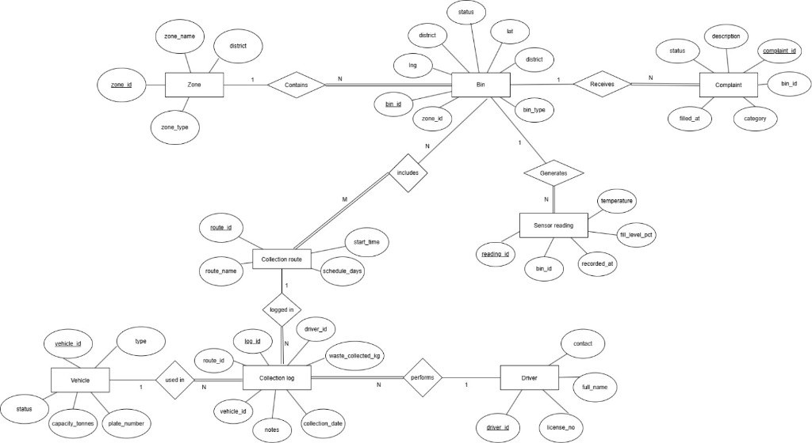

# ♻️ Smart Waste Management System

A full-stack web application for managing urban waste collection, monitoring bin fill levels via IoT sensors, handling citizen complaints, and optimizing collection routes.

Built with **Node.js**, **Express**, **Sequelize ORM**, **SQLite**, and a modern **dark-themed dashboard** frontend.

---

## 📸 Features

- **Dashboard** — Real-time overview with stat cards, interactive charts (Chart.js), and a Leaflet.js map showing color-coded bins by fill level
- **Bin Management** — Full CRUD with zone/status/type filters and live fill-level indicators
- **Complaint Tracking** — File, update, and resolve citizen complaints with category and status filters
- **Collection Routes** — Create and manage waste collection routes with bin assignments (M:N)
- **Collection Logs** — Record daily collection activity with driver, vehicle, route, and waste weight
- **Fleet & Drivers** — Manage vehicles (card grid) and drivers (data table) with full CRUD
- **Zone Management** — Organize bins into geographical zones with overview stats
- **Authentication** — Session-based admin login with bcrypt password hashing

---

## 🛠️ Tech Stack

| Layer | Technology |
|---|---|
| Backend | Node.js + Express.js |
| Database | SQLite (via Sequelize ORM) |
| Frontend | Vanilla HTML / CSS / JavaScript |
| Charts | Chart.js |
| Maps | Leaflet.js + OpenStreetMap |
| Auth | express-session + bcrypt |

---

## 📐 ER Diagram



The database implements the following entities and relationships:

| Entity | Key Attributes |
|---|---|
| **Zone** | zone_id, zone_name, district, zone_type |
| **Bin** | bin_id, zone_id (FK), status, district, lat, lng, bin_type |
| **Complaint** | complaint_id, bin_id (FK), status, description, category, filled_at |
| **Sensor Reading** | reading_id, bin_id (FK), temperature, fill_level_pct, recorded_at |
| **Collection Route** | route_id, route_name, schedule_days, start_time |
| **Collection Log** | log_id, route_id (FK), vehicle_id (FK), driver_id (FK), waste_collected_kg, collection_date, notes |
| **Vehicle** | vehicle_id, type, status, capacity_tonnes, plate_number |
| **Driver** | driver_id, full_name, contact, license_no |

### Relationships
- Zone `1 → N` Bin
- Bin `1 → N` Complaint
- Bin `1 → N` Sensor Reading
- Collection Route `M ↔ N` Bin (junction table: `route_bins`)
- Vehicle `1 → N` Collection Log
- Driver `1 → N` Collection Log
- Collection Route `1 → N` Collection Log

---

## 🚀 Getting Started

### Prerequisites

- [Node.js](https://nodejs.org/) (v18 or higher)

### Installation

```bash
# 1. Clone the repository
git clone https://github.com/<your-username>/smart-waste-management.git
cd smart-waste-management

# 2. Install dependencies
npm install

# 3. Seed the database with demo data
npm run seed

# 4. Start the development server
npm run dev
```

### Access the Application

Open [http://localhost:3000](http://localhost:3000) in your browser.

**Default Login Credentials:**
| Username | Password |
|---|---|
| `admin` | `admin123` |

---

## 📁 Project Structure

```
smart-waste-management/
├── server.js                    # Express entry point
├── package.json
├── .env                         # Environment variables
├── .gitignore
├── db/
│   ├── config.js               # Sequelize SQLite connection
│   └── seed.js                 # Demo data seeder
├── models/
│   ├── index.js                # Model registry & associations
│   ├── Zone.js
│   ├── Bin.js
│   ├── Complaint.js
│   ├── SensorReading.js
│   ├── CollectionRoute.js
│   ├── RouteBin.js             # Junction table (M:N)
│   ├── CollectionLog.js
│   ├── Vehicle.js
│   ├── Driver.js
│   └── Admin.js
├── routes/
│   ├── auth.js                 # Login / Logout / Session
│   ├── dashboard.js            # Analytics API
│   ├── zones.js
│   ├── bins.js
│   ├── complaints.js
│   ├── sensors.js
│   ├── routes.js
│   ├── collection-logs.js
│   ├── vehicles.js
│   └── drivers.js
├── middleware/
│   └── auth.js                 # Session auth guard
└── public/
    ├── index.html              # Login page
    ├── dashboard.html          # Main dashboard
    ├── bins.html
    ├── complaints.html
    ├── routes.html
    ├── collection-logs.html
    ├── fleet.html
    ├── zones.html
    ├── css/
    │   └── styles.css          # Design system (dark theme)
    └── js/
        ├── app.js              # Shared utilities
        ├── dashboard.js
        ├── bins.js
        ├── complaints.js
        ├── routes.js
        ├── collection-logs.js
        ├── fleet.js
        └── zones.js
```

---

## 📡 API Endpoints

### Authentication
| Method | Endpoint | Description |
|---|---|---|
| POST | `/api/auth/login` | Admin login |
| POST | `/api/auth/logout` | Logout |
| GET | `/api/auth/me` | Current session |

### Dashboard
| Method | Endpoint | Description |
|---|---|---|
| GET | `/api/dashboard/stats` | Overview statistics |
| GET | `/api/dashboard/fill-trend` | 7-day fill level trend |
| GET | `/api/dashboard/waste-by-zone` | Waste collected per zone |
| GET | `/api/dashboard/complaint-breakdown` | Complaints by category |
| GET | `/api/dashboard/recent-activity` | Recent events feed |

### Resources (Full CRUD)
| Resource | Base Endpoint |
|---|---|
| Zones | `/api/zones` |
| Bins | `/api/bins` |
| Complaints | `/api/complaints` |
| Sensor Readings | `/api/sensors` |
| Collection Routes | `/api/routes` |
| Collection Logs | `/api/collection-logs` |
| Vehicles | `/api/vehicles` |
| Drivers | `/api/drivers` |

---

## 🌱 Seed Data

The seed script (`npm run seed`) generates realistic demo data:

| Entity | Count |
|---|---|
| Zones | 5 |
| Bins | 60 |
| Sensor Readings | 380+ |
| Drivers | 6 |
| Vehicles | 8 |
| Collection Routes | 10 |
| Collection Logs | 120 |
| Complaints | 35 |

---

## 📝 License

This project is licensed under the ISC License.
